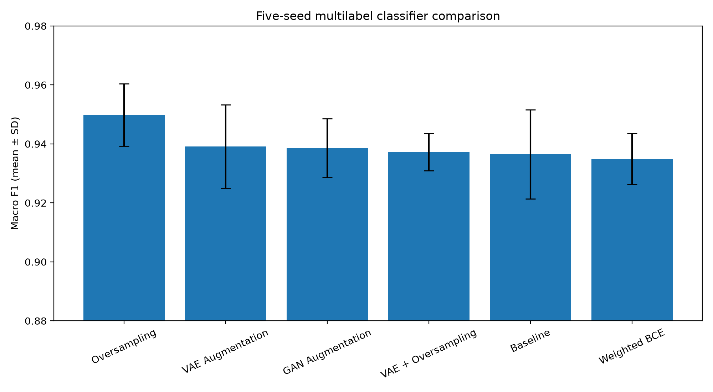
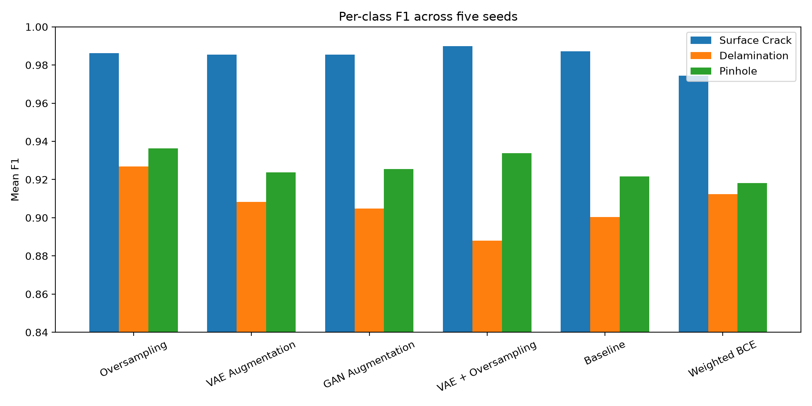
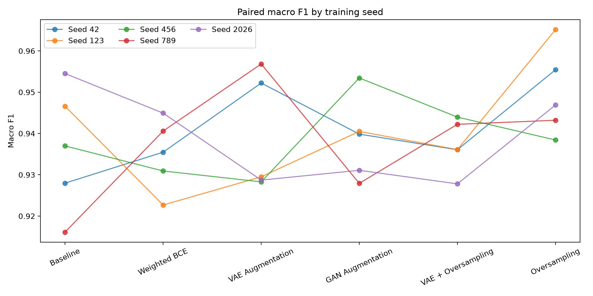
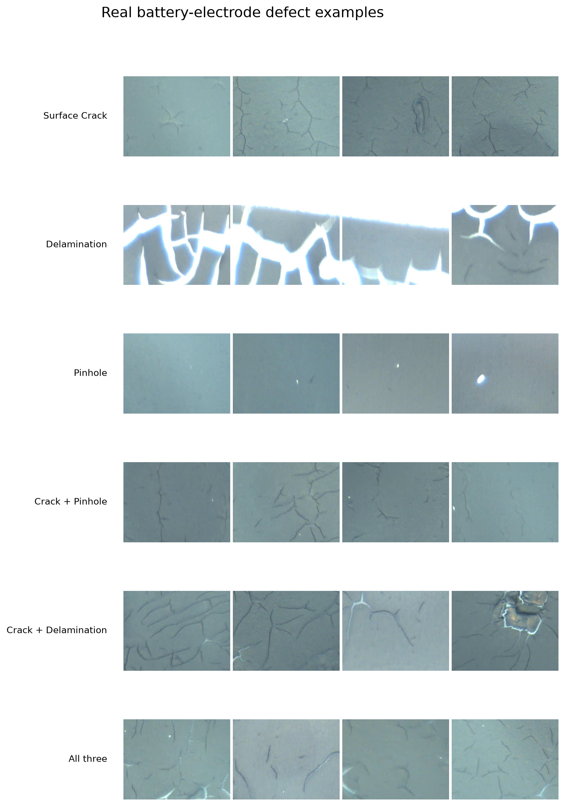
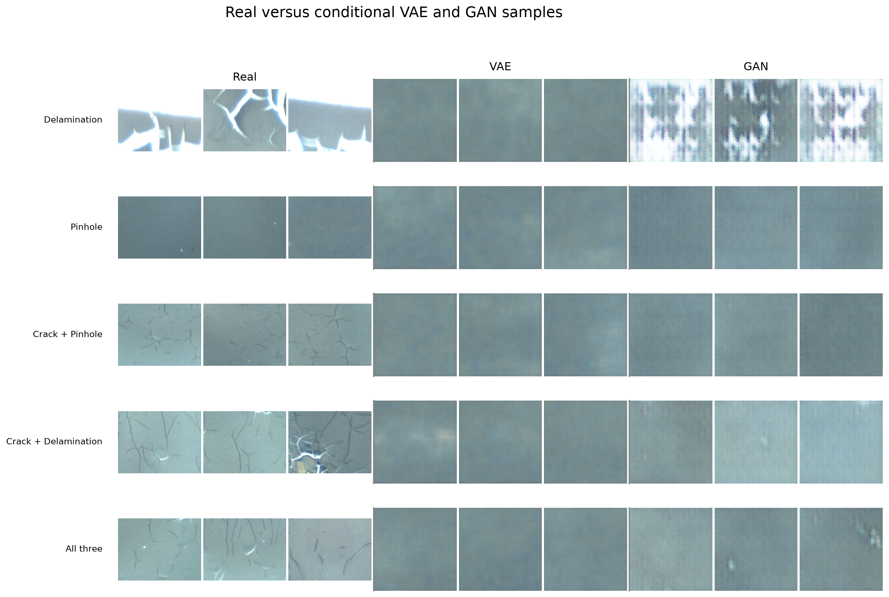

# Battery Electrode Defect Augmentation

Synthetic-data augmentation for multilabel lithium-ion battery electrode coating defect classification using a ResNet-18 classifier, conditional VAE, and conditional GAN.

> This README is generated from the frozen split manifests and metric CSVs. Do not edit its result tables manually; run `uv run python notebooks/multilabel/generate_readme.py` instead.

## Research question

Do synthetic minority-defect images improve classification beyond strong non-generative controls such as class weighting and random oversampling?

The three independent targets are Surface Crack, Delamination, and Pinhole. Images can contain more than one recognized defect. Unclassified images and rows without a recognized defect are excluded.

## Experimental protocol

- Source-frame groups are disjoint across train, validation, and test splits.
- Validation data selects checkpoints; test images remain real and are used only for final metrics.
- Synthetic images are added only to the training set.
- All classifier arms use ResNet-18, Adam, and the same five seeds: 42, 123, 456, 789, and 2026.
- Training runs for at most 30 epochs with patience-5 early stopping on validation macro F1.
- Per-class decision thresholds are selected on validation data and then frozen for real-only test evaluation.
- Primary metrics are macro F1, micro F1, per-class F1, exact-match accuracy, and Hamming loss.

The current frozen dataset contains 2105 usable images from 359 source frames.

| Split | Images | Source frames | Surface Crack | Delamination | Pinhole | Multilabel images |
|---|---:|---:|---:|---:|---:|---:|
| Train | 1503 | 255 | 1365 | 146 | 358 | 345 |
| Val | 302 | 53 | 274 | 31 | 72 | 70 |
| Test | 300 | 51 | 276 | 26 | 73 | 70 |

## Experimental arms

| Method | Change from baseline |
|---|---|
| Baseline | Pretrained ResNet-18 with unweighted BCE loss |
| Weighted BCE | Up-weights minority positive labels in the loss |
| Oversampling | Samples training images using inverse label frequency |
| VAE Augmentation | Adds conditional-VAE minority samples to training |
| GAN Augmentation | Adds conditional-GAN minority samples to training |
| VAE + Oversampling | Adds VAE samples and applies weighted random sampling |

## Five-seed results

Values are mean ± sample standard deviation across five seeds. Every method uses the same frozen source-frame splits and evaluation protocol.

| Method | Runs | Exact match | Micro F1 | Macro F1 | Surface Crack F1 | Delamination F1 | Pinhole F1 |
|---|---:|---:|---:|---:|---:|---:|---:|
| Oversampling | 5 | 0.9360 ± 0.0098 | 0.9723 ± 0.0039 | 0.9498 ± 0.0106 | 0.9862 ± 0.0020 | 0.9268 ± 0.0315 | 0.9364 ± 0.0198 |
| VAE Augmentation | 5 | 0.9320 ± 0.0126 | 0.9680 ± 0.0069 | 0.9391 ± 0.0142 | 0.9854 ± 0.0037 | 0.9082 ± 0.0306 | 0.9237 ± 0.0177 |
| GAN Augmentation | 5 | 0.9360 ± 0.0068 | 0.9686 ± 0.0040 | 0.9386 ± 0.0100 | 0.9855 ± 0.0037 | 0.9048 ± 0.0263 | 0.9254 ± 0.0112 |
| VAE + Oversampling | 5 | 0.9447 ± 0.0128 | 0.9720 ± 0.0054 | 0.9372 ± 0.0064 | 0.9898 ± 0.0025 | 0.8881 ± 0.0177 | 0.9338 ± 0.0244 |
| Baseline | 5 | 0.9340 ± 0.0060 | 0.9687 ± 0.0045 | 0.9364 ± 0.0151 | 0.9873 ± 0.0034 | 0.9004 ± 0.0427 | 0.9217 ± 0.0093 |
| Weighted BCE | 5 | 0.9080 ± 0.0205 | 0.9588 ± 0.0083 | 0.9349 ± 0.0086 | 0.9743 ± 0.0094 | 0.9123 ± 0.0212 | 0.9181 ± 0.0106 |

The highest mean macro F1 is 0.9498 from Oversampling. The highest mean exact-match accuracy is 0.9447 from VAE + Oversampling. The strongest synthetic-only arm, VAE Augmentation, trails ordinary oversampling by 0.0107 mean macro F1. Adding VAE samples to oversampling also trails ordinary oversampling by 0.0126, largely because its mean Delamination F1 falls to 0.8881.

The main finding is that ordinary random oversampling is the strongest overall method. Learned synthetic augmentation does not improve macro F1 beyond this simpler non-generative control.

## Paired analysis

Because every method uses the same five seeds, macro-F1 differences can be paired by seed. Positive differences favor oversampling.

| Comparison | Mean macro-F1 difference | Bootstrap 95% CI | Seed wins | Exact p | Holm-adjusted p |
|---|---:|---:|---:|---:|---:|
| Oversampling - Weighted BCE | 0.0149 | [0.0033, 0.0299] | 5/5 | 0.0625 | 0.3125 |
| Oversampling - Baseline | 0.0134 | [0.0011, 0.0255] | 4/5 | 0.1875 | 0.5625 |
| Oversampling - VAE + Oversampling | 0.0126 | [0.0007, 0.0232] | 4/5 | 0.1875 | 0.5625 |
| Oversampling - GAN Augmentation | 0.0113 | [-0.0028, 0.0210] | 4/5 | 0.1250 | 0.5000 |
| Oversampling - VAE Augmentation | 0.0107 | [-0.0039, 0.0254] | 4/5 | 0.3125 | 0.5625 |

Oversampling wins four or five of the five paired seeds against every comparator. However, with only five pairs the exact sign-flip test has coarse resolution, and no comparison remains significant after Holm correction. The result therefore supports a consistent positive effect for oversampling, but not a definitive formal significance claim.

## Figures







### Qualitative examples





The learned generators capture broad electrode color and texture, but the VAE samples are visibly blurred and many GAN samples lack the distinct conditioned defect structures present in real images. This qualitative gap is consistent with synthetic augmentation failing to outperform ordinary oversampling.

## Repository layout

```text
battery-electrode-defect-augmentation/
├── configs/experiment.json               # shared seeds and hyperparameters
├── data/
│   ├── raw/archive/classification/       # local labels and real images
│   ├── processed/multilabel/             # frozen splits and metric CSVs
│   └── synthetic/                        # generated images and metadata
├── models/multilabel/                    # tracked trained checkpoints
├── results/                              # per-seed metrics and summaries
├── scripts/
│   ├── run_experiments.py                # validation and multi-seed training CLI
│   ├── summarize_results.py              # mean and standard-deviation tables
│   ├── analyze_results.py                # paired tests and result figures
│   └── plot_qualitative_examples.py       # real/VAE/GAN example grids
├── src/battery_defects/                  # shared experiment pipeline
├── tests/                                # data, training-protocol, and analysis checks
└── notebooks/multilabel/
    ├── 01_multilabel_exploration.ipynb
    ├── 02_multilabel_preparation.ipynb
    ├── 03_multilabel_baseline.ipynb
    ├── 04_multilabel_weighted.ipynb
    ├── 05_multilabel_oversampling.ipynb
    ├── 06_conditional_vae.ipynb
    ├── 07_vae_generation.ipynb
    ├── 08_vae_augmented_classifier.ipynb
    ├── 09_conditional_gan.ipynb
    ├── 10_gan_augmented_classifier.ipynb
    ├── 11_multilabel_comparison.ipynb
    ├── 12_vae_oversampling.ipynb
    ├── generative_models.py
    ├── multilabel_utils.py
    └── generate_readme.py
```

## Installation

This project uses Python 3.12 and [`uv`](https://docs.astral.sh/uv/) for reproducible dependency management.

Clone the repository and enter its directory:

```bash
git clone https://github.com/kevinnishitoyo/battery-electrode-defect-augmentation.git
cd battery-electrode-defect-augmentation
```

Create the virtual environment and install the locked dependencies:

```bash
uv sync
```

Verify the installation using tests that do not require locally downloaded real or synthetic image files:

```bash
uv run pytest -q -m "not data"
```

## Dataset

This project uses the public [Battery Electrode Coating Defect Dataset](https://www.kaggle.com/datasets/vigneshirtt/li-ion-battery-coating-defect-dataset).

Kaggle lists the dataset under **CC0: Public Domain**. The raw images are not duplicated in this repository.

Please cite the associated publication:

Sampath, V., Lee, A.S., Miller, S.D. et al. *A Defect Dataset for Electrode Coating Manufacturing*. Scientific Data (2026). https://doi.org/10.1038/s41597-025-06419-1

## Data setup

Download and extract the Kaggle dataset, then place its classification files under:

```text
data/raw/archive/classification/
├── labels.csv
└── images/
```

The preparation notebook creates group-separated manifests under `data/processed/multilabel/`.

## Run the experiments

Validate all image paths and confirm that source-frame groups are isolated:

```bash
uv run python scripts/run_experiments.py --validate-only
```

Run a one-epoch smoke test in a separate result namespace:

```bash
uv run python scripts/run_experiments.py --method baseline --seed 42 --epochs 1 --run-name smoke --skip-test
```

Run every method across the five configured seeds:

```bash
uv run python scripts/run_experiments.py --method all --all-seeds
uv run python scripts/summarize_results.py
uv run python scripts/analyze_results.py
```

Regenerate the qualitative image grids:

```bash
uv run python scripts/plot_qualitative_examples.py
```

The notebooks remain useful for exploration and generator training. Their execution order is documented in [`notebooks/multilabel/README.md`](notebooks/multilabel/README.md).

After metrics change, regenerate this README:

```bash
uv run python notebooks/multilabel/generate_readme.py
```

Check that it is current without rewriting it:

```bash
uv run python notebooks/multilabel/generate_readme.py --check
```

Run the automated tests:

```bash
uv run pytest -q
```

## Limitations and next steps

- Five seeds quantify training variability, but the results still come from one fixed dataset split.
- Compare several synthetic-data quantities against a sample-budget-matched oversampling control.
- Inspect real/generated grids, diversity, and nearest neighbours before claiming synthetic quality.
